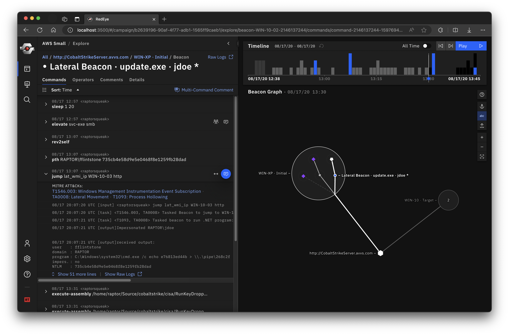

# RedEye

Red Team C2 Log Visualization



RedEye is an open-source analytic tool developed by CISA and DOE’s Pacific Northwest National Laboratory to assist Red Teams with visualizing and reporting command and control activities. This tool, released in October 2022 on GitHub, allows an operator to assess and display complex data, evaluate mitigation strategies, and enable effective decision making in response to a Red Team assessment. The tool parses logs, such as those from Cobalt Strike, and presents the data in an easily digestible format. The users can then tag and add comments to activities displayed within the tool. The operators can use the RedEye’s presentation mode to present findings and workflow to stakeholders.

RedEye can assist an operator to efficiently:

- Replay and demonstrate Red Team’s assessment activities as they occurred rather than manually pouring through thousands of lines of log text.
- Display and evaluate complex assessment data to enable effective decision making.
- Gain a clearer understanding of the attack path taken and the hosts compromised during a Red Team assessment or penetration test.

Red Team:
[](https://cloud.cypress.io/projects/rsybgk/runs)

Blue Team:
[](https://cloud.cypress.io/projects/46ahz3/runs)

## [User Guide](<docs/User Guide.md>)

## Quick start

The fastest way to get up and running is by downloading the latest `RedEye` binaries for your operating system in the [Releases](https://github.com/cisagov/RedEye/releases) section on GitHub.

RedEye currently supports uploading Cobalt Strike logs and offers both Red Team and Blue Team modes.

- The Red Team mode offers the ability to upload campaign logs, explore, and create presentations. This mode is started by running RedEye with the `SERVER_BLUE_TEAM=false` environment variable or the
  `--redTeam` argument.
- The Blue Team mode enables the ability to review a read-only campaign exported by a Red Team. This mode runs by default.

Note: Both Red and Blue Team modes can be started from the same `RedEye` application binary.

### Blue Team

The Blue Team version can be run by double-clicking the `RedEye` application binary.

`RedEye` runs by default at `http://127.0.0.1:4000` and will automatically open your default browser.

If a `campaigns` folder is located in the same directory as the `RedEye` application, RedEye will attempt to import any `.redeye` campaign files within. Campaign files can be exported in the "Red Team" version.

To prepare a version for the Blue Team, follow these two steps:

1. Copy the `RedEye` application binary to an empty folder.
2. Create a `campaigns` folder in the same directory and place the `.redeye` campaign files you want to send inside.

### Red Team

The Red Team version comes in two parts:

- The `RedEye` application binary and
- The `parsers` folder containing the `cs-parser` Cobalt Strike log parser binary.

There are two options to run RedEye:

1. Run the downloaded binary: `AUTHENTICATION_PASSWORD=<your_password> ./RedEye --redTeam`.
2. Clone this repository and either:
   <ol type="A">
    <li>Docker Compose:</li>
       <ol type="i">
        <li>Update the environment variables in `docker-compose.yml`.</li>
        <li>Run: `docker-compose -f docker-compose.yml up -d redeye-core`.</li>
       </ol>
    <li>Install and run the project directly (covered in the <a href="#local-build">Local Build</a> section).</li>
   </ol>

The application runs by default at `http://127.0.0.1:4000`.

## Platform support

- Linux
  - Ubuntu 18 and newer
  - Kali Linux 2020.1 and newer
  - Others may be supported but are untested
- macOS
  - El Capitan and newer
- Windows
  - Windows 7 and newer

ARM support is experimental

_Note: For Mac users, when first running the `RedEye` application (and `cs-parser` if using the Red Team version), you must go to "System Preferences" then "Security & Privacy" and click "Open Anyway"._

## Local Build

### Required Packages

- [Node.js](https://nodejs.org/en/) >= v16

- Install yarn: `npm install -g yarn`
- Run: `yarn install` // Installs all packages
- Run either:
  1. `yarn release:all` to build a binary for Linux, macOS, and Windows
  2. `yarn release --platform (mac|win|linux)` to build for a specific platform.
  - platform options:
    - mac
    - win
    - linux

## Development

### Setup

- Install yarn: `npm install -g yarn`
- Run: `yarn install` // Installs all packages

#### Quick Start Development

Runs the project in development mode

```sh
yarn run start
```

#### Advanced Development

It is recommended to run the server and client in two separate terminals

```sh
yarn run start:client
```

```sh
yarn run start:server
```

#### Build

`yarn build:all` to build all applications and their dependent libraries

#### Server .env example

```env
AUTHENTICATION_PASSWORD=937038570
AUTHENTICATION_SECRET=supertopsecretdonttellanyone
DATABASE_MODE=DEV_PERSIST
SERVER_BLUE_TEAM=false
SERVER_PRODUCTION=false
```

---

<div align="center">
  
  
</div>
